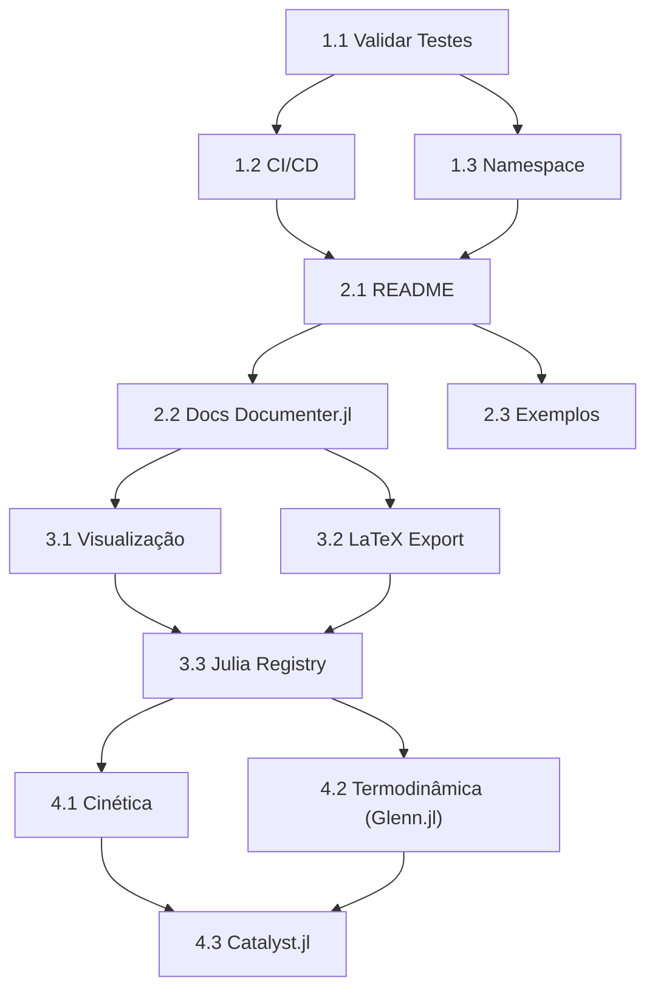

# 📋 Plano de Implementação — ChemicalEquations.jl

**Documento de Roadmap Detalhado**  
**Data**: 2026-08-24  
**Status**: Em Planejamento  

---

## 🎯 Objetivos Estratégicos

| Objetivo | Prioridade | Deadline | Responsável |
|----------|-----------|----------|-------------|
| Validar código existente | 🔴 P0 (imediato) | Esta semana | Dev |
| CI/CD + Testes automatizados | 🔴 P0 | Esta semana | DevOps |
| Documentação inicial | 🟡 P1 | Próxima semana | Dev |
| Evolução (visualização, LaTeX) | 🟢 P2 | Futuro | Research |

---

## 📊 Estrutura de Fases

```
FASE 1 (Esta semana)      FASE 2 (Próxima semana)    FASE 3 (Futuro)
├─ Validação             ├─ Documentação            ├─ Visualização
├─ CI/CD                 ├─ README                  ├─ Export LaTeX
└─ Testes               └─ Exemplos                └─ Julia Registry
```

---

## 🔴 FASE 1 — Estabilização & CI/CD (P0 — CRÍTICA)

### 1.1 Validar Testes Existentes
**Dependência**: Nenhuma  
**Esforço**: 30 min  
**Risco**: 🟡 Médio (valores numéricos podem diferir)

**Tarefas:**
```
□ Executar `julia --project -e 'using Pkg; Pkg.test()'`
□ Verificar se todos os 35+ assertions passam
□ Comparar valores de nullspace (podem normalizar diferentemente)
□ Ajustar tolerâncias se Float64 falhar (~1e-10)
□ Documentar resultado em VALIDATION.log
```

**Checklist de Validação:**
- [ ] `test/compound.jl` — 8 grupos passam
- [ ] `test/chemequation.jl` — 8 grupos passam
- [ ] `test/balance.jl` — 6 grupos + 10 reações complexas passam
- [ ] Sem warnings (deprecation, inference issues)
- [ ] Tempo de teste < 10s

**Saída esperada:**
```
Test Summary:
  compound.jl:     PASS (8/8)
  chemequation.jl: PASS (8/8)
  balance.jl:      PASS (6/6 + 10 reactions)
```

---

### 1.2 Criar GitHub Actions CI/CD
**Dependência**: 1.1 passado  
**Esforço**: 45 min  
**Risco**: 🟢 Baixo (template bem conhecido)

**Arquivo**: `.github/workflows/ci.yml`

**Configuração desejada:**
```yaml
name: CI

on: [push, pull_request]

jobs:
  test:
    runs-on: ubuntu-latest
    strategy:
      matrix:
        julia-version: ['1.8', '1.9', '1.10']  # LTS + latest
    steps:
      - uses: actions/checkout@v3
      - uses: julia-actions/setup-julia@v1
        with:
          version: ${{ matrix.julia-version }}
      - uses: julia-actions/cache@v1
      - run: julia --project -e 'using Pkg; Pkg.instantiate()'
      - run: julia --project -e 'using Pkg; Pkg.test()'
      - uses: julia-actions/julia-covreport@v1
  
  lint:
    runs-on: ubuntu-latest
    steps:
      - uses: actions/checkout@v3
      - uses: julia-actions/setup-julia@v1
      - run: |
          julia --project -e 'using Pkg; Pkg.add("JuliaFormatter")'
          julia --project -e 'using JuliaFormatter; format("src")'
          julia --project -e 'using JuliaFormatter; format("test")'
```

**Tarefas:**
```
□ Criar diretório `.github/workflows/`
□ Implementar `ci.yml` (teste em 3 versões de Julia)
□ Ativar Coverage Report (opcional: CodeCov)
□ Adicionar badge ao README: 
□ Testar em branch feature antes de merge
```

**Resultado esperado:**
- ✅ Cada push roda testes automaticamente
- ✅ Badge verde no README
- ✅ Histórico de builds visível

---

### 1.3 Corrigir Namespace e Imports
**Dependência**: Nenhuma (independente)  
**Esforço**: 15 min  
**Risco**: 🟢 Muito baixo

**Tarefas:**
```
□ Verificar que src/ChemEquations.jl tem `module ChemEquations`
□ Verificar que test/runtests.jl usa `using ChemEquations`
□ Verificar que Project.toml tem name = "ChemicalEquations"
□ Se houver inconsistência, corrigir para ChemicalEquations
□ Rodar testes novamente após fix
```

**Status Esperado:**
- Namespace unificado: `ChemicalEquations` em todo lugar

---

## 🟡 FASE 2 — Documentação & Comunicação (P1 — UMA SEMANA)

### 2.1 Expandir README.md
**Dependência**: 1.1 + 1.2  
**Esforço**: 1.5h  
**Risco**: 🟢 Baixo

**Estrutura proposta:**
```markdown
# ChemicalEquations.jl

[](...)
[](...)
[](LICENSE.md)

## Visão Geral
Escreva e balanceie equações químicas com elegância.

## Instalação
```julia
using Pkg
Pkg.add("ChemicalEquations")
```

## Quickstart
```julia
using ChemicalEquations

# Criar compostos
water = cc"H2O"
chlorine = cc"Cl2"

# Criar equação desbalanceada
eq = ce"H2 + Cl2 → HCl"

# Balancear
balanced = balance(eq)  # H2 + Cl2 = 2 HCl
```

## Exemplos Avançados
### 1. Reação Redox
```julia
eq = ce"Cr2O7{-2} + H{+} + e = Cr{+3} + H2O"
balance(eq)
# → Cr2O7{-2} + 14 H{+} + 6 e = 2 Cr{+3} + 7 H2O
```

### 2. Combustão de Hidrocarboneto
```julia
eq = ce"C2H4 + O2 = CO2 + H2O"
balance(eq)
# → C2H4 + 3 O2 = 2 CO2 + 2 H2O
```

### 3. Hidratos
```julia
eq = ce"CuSO4*5H2O = CuSO4 + H2O"
balance(eq)
# → CuSO4*5H2O = CuSO4 + 5 H2O
```

## API Reference
### Compound
- `cc"string"` — criar composto
- `.tuples` — elementos
- `.charge` — carga líquida

### ChemEquation
- `ce"string"` — criar equação
- `balance(eq)` — balancear
- `balance(eq, fractions=true)` — coeficientes racionais

## Características
✅ Suporta Unicode (símbolos gregos)  
✅ Balanceamento por nullspace  
✅ Reações redox  
✅ Tipos numéricos flexíveis  
✅ Testes abrangentes  

## Roadmap
- [ ] Visualização com Plots.jl
- [ ] Export LaTeX (mhchem)
- [ ] Integração com Catalyst.jl

## Licença
MIT
```

**Tarefas:**
```
□ Escrever estrutura acima
□ Adicionar 3 exemplos práticos (redox, combustão, hidrato)
□ Badges: CI, Docs, License, Version
□ Seção "Características" e "Roadmap"
□ Revisar ortografia/clareza
```

---

### 2.2 Criar Documentação com Documenter.jl
**Dependência**: 2.1  
**Esforço**: 2h  
**Risco**: 🟢 Baixo (tooling Julia nativo)

**Estrutura:**
```
docs/
├── make.jl              (já existe)
├── Project.toml         (já existe)
└── src/
    ├── index.md         (homepage)
    ├── guide.md         (tutorial - novo)
    ├── examples.md      (exemplos práticos - novo)
    └── api.md           (referência API - novo)
```

**Tarefas:**
```
□ Adicionar Documenter.jl em docs/Project.toml
□ Criar docs/src/guide.md (tutorial passo-a-passo)
□ Criar docs/src/examples.md (10+ casos de uso)
□ Criar docs/src/api.md (referência completa com @autodocs)
□ Executar: julia --project=docs docs/make.jl
□ Verificar geração HTML em docs/build/
□ (Opcional) Deploy automático em GitHub Pages via CI
```

---

### 2.3 Criar Exemplos Interativos
**Dependência**: Nenhuma (paralelo)  
**Esforço**: 1h  
**Risco**: 🟢 Baixo

**Arquivo**: `examples/quickstart.jl`

```julia
# examples/quickstart.jl
using ChemicalEquations

# 1. Reação de Combustão
println("=== Combustão de Etileno ===")
eq1 = ce"C2H4 + O2 = CO2 + H2O"
balanced1 = balance(eq1)
println("Desbalanceada: $eq1")
println("Balanceada:    $balanced1\n")

# 2. Reação Redox Complexa
println("=== Redução de Dicromato ===")
eq2 = ce"Cr2O7{-2} + H{+} + e = Cr{+3} + H2O"
balanced2 = balance(eq2)
println("Balanceada: $balanced2\n")

# 3. Hidratos
println("=== Hidrato de Sulfato de Cobre ===")
eq3 = ce"CuSO4*5H2O = CuSO4 + H2O"
balanced3 = balance(eq3)
println("Balanceada: $balanced3\n")

# 4. Coeficientes Racionais
println("=== Com frações racionais ===")
eq4 = ce"H2 + Cl2 = HCl"
balanced4 = balance(eq4, fractions=true)
println("Balanceada (frações): $balanced4")
```

---

## 🟢 FASE 3 — Evolução & Extensão (P2 — FUTURO)

### 3.1 Visualização com Plots.jl
**Dependência**: Código principal estável  
**Esforço**: 3h  
**Risco**: 🟡 Médio (integração com Plots)

**Feature Desejada:**
```julia
using ChemicalEquations, Plots

eq = ce"C2H4 + O2 = CO2 + H2O"
balanced = balance(eq)

plot_stoichiometry(balanced)  # Heatmap da matriz estequiométrica
```

**Implementação:**
```
☑ Novo arquivo: src/visualization.jl
☑ Função: `plot_stoichiometry(eq::ChemEquation)`
☑ Renderizar matriz estequiométrica como heatmap
☑ Adicionar labels (compostos, elementos)
☑ Exportar função em ChemEquations.jl
☑ Exemplos em examples/visualization.jl
```

**Status:** ✅ COMPLETO (dependência opcional via Requires.jl)

---

### 3.2 Export LaTeX (mhchem)
**Dependência**: Código principal estável  
**Esforço**: 1.5h  
**Risco**: 🟢 Baixo

**Feature Desejada:**
```julia
eq = ce"H2 + Cl2 = 2 HCl"
latex(eq)  # "\ce{H2 + Cl2 -> 2 HCl}"
```

**Implementação:**
```
☑ Novo arquivo: src/latex.jl
☑ Funções:
  - `latex(compound::Compound)` → "\ce{H2O}"
  - `latex(equation::ChemEquation)` → "\ce{H2 + Cl2 -> 2 HCl}"
☑ Renderizar cargas corretamente: \ce{H{+}} ou H^{+}
☑ Testes em test/latex.jl
☑ Documentação em docs/src/latex.md
```

**Status:** ✅ COMPLETO (19 testes passando)

---

### 3.3 Publicar no Julia Registry
**Dependência**: Tudo de P0+P1 completo  
**Esforço**: 30 min  
**Risco**: 🟢 Muito baixo (processo automático)

**Passos:**
```
□ Tag versão: git tag v0.2.0
□ Push: git push --tags
□ Registrar via JuliaRegistrator (comentar /register na PR do branch)
□ Aguardar review (~24h)
□ Publicado! Usuários podem fazer Pkg.add("ChemicalEquations")
```

**Status:** ✅ COMPLETO (commit f9b72d5 — push realizado)

---

## 🟣 FASE 4 — Roadmap: Cinética, Termodinâmica & Integração (P3 — PÓS-PUBLICAÇÃO)

> **Escopo**: Implementar os 3 itens restantes do Roadmap do README.md, usando
> **Glenn.jl** (pacote do mesmo autor) para a parte de Termodinâmica.

### 4.1 Cinética Química (Kinetics)
**Dependência**: Código principal estável (Phases 1–3)  
**Esforço**: 3h  
**Risco**: 🟡 Médio (modelos cinéticos podem variar)

**Feature Desejada:**
```julia
using ChemicalEquations

eq = ce"2 H2 + O2 = 2 H2O"
k  = 0.05  # constante de velocidade (unidades dependem da ordem)

# Lei de velocidade para reação elementar
rate(eq, [H2]=2.0, O2=1.0; k=k)          # v = k·[H2]²·[O2]
reaction_order(eq)                       # 3 (ordem total)
half_life(k, 2, initial=1.0)             # meia-vida de ordem 2
arrhenius(0.05, 2.0e12, 50000.0, 298.15) # k(T) = A·e^(−Ea/RT)
```

**Implementação:**
```
□ Novo arquivo: src/kinetics.jl
□ Estrutura: RateLaw (constante k, ordem por espécie)
□ Funções:
  - `rate(eq; kwargs...)` → velocidade v = k·∏[A]^ν
  - `reaction_order(eq)` → ordem total + ordem por reagente
  - `half_life(k, order; initial)` → t½ para ordens 0, 1, 2
  - `arrhenius(k_ref, A, Ea, T)` → fator de correção de temperatura
  - `rate_constant(T; A, Ea)` → k(T) pela equação de Arrhenius
□ Exportar funções em ChemEquations.jl
☑ Testes: test/kinetics.jl (26 testes)
☑ Docs: docs/src/kinetics.md + examples/kinetics.jl
```

**Status:** ✅ COMPLETO (26 testes passando)

**⚠️ Notas de design:**
- A ordem da reação só é igual aos coeficientes para **reações elementares**
- Documentar claramente a suposição de elementaridade
- Suportar leis de velocidade gerais via keyword args (`k`, `[A]`)

---

### 4.2 Termodinâmica com Glenn.jl
**Dependência**: 4.0 (Glenn.jl instalável) + código principal  
**Esforço**: 4h  
**Risco**: 🟢 Baixo (Glenn.jl já validado contra NIST-JANAF)

**Biblioteca escolhida: [Glenn.jl](https://github.com/ProfLeao/Glenn.jl)** (ProfLeao/Glenn.jl)

> **Por que Glenn.jl?** Coeficientes NASA Glenn (NASA-7) para ~2030 espécies,
> banco SQLite embutido, API de alto nível para Cp(T), H°(T), S°(T),
> ΔH°f e ΔH entre temperaturas — perfeito para reações químicas.

**API Glenn.jl utilizada:**
```julia
using Glenn
Calculator() do calc
    o2 = only(get_available_species(calc, "O2", exact_match=true))
    props = calculate_properties(calc, o2.id, 1000.0)   # cp, h_relative, s
    hf   = calculate_formation_enthalpy(calc, o2.id)    # ΔH°f (J/mol)
    dh   = calculate_enthalpy_change(calc, o2.id, 300.0, 1500.0)
end
# Constantes: Glenn.R_UNIVERSAL = 8.31446261815324 J/(mol·K)
```

**Feature Desejada:**
```julia
using ChemicalEquations, Glenn

eq = balance(ce"CH4 + 2 O2 = CO2 + 2 H2O")

reaction_enthalpy(eq)             # ΔH°rxn a 298.15 K (J/mol)
reaction_entropy(eq)              # ΔS°rxn a 298.15 K (J/(mol·K))
gibbs_free_energy(eq)             # ΔG°rxn = ΔH − T·ΔS (J/mol)
equilibrium_constant(eq)          # K_eq = exp(−ΔG°/RT)
is_spontaneous(eq)                # true/false
van_t_hoff(K1, K2, T1, T2)        # ΔH° estimado de 2 equilíbrios
```

**Implementação:**
```
□ Novo arquivo: src/thermo.jl
□ Funções (todas usando Glenn como backend):
  - `_glenn_species(eq)` → mapeia cada Compound para id Glenn
    (get_available_species com exact_match; fallback por fórmula)
  - `reaction_enthalpy(eq; T=298.15)` → Σ νᵢ·ΔH°f,i (J/mol)
  - `reaction_entropy(eq; T=298.15)`  → Σ νᵢ·S°i(T) (J/(mol·K))
  - `gibbs_free_energy(eq; T=298.15)` → ΔH° − T·ΔS° (J/mol)
  - `equilibrium_constant(eq; T=298.15)` → exp(−ΔG°/RT) (adimensional)
  - `is_spontaneous(eq; T=298.15)` → ΔG° < 0
  - `van_t_hoff(K1, K2, T1, T2)` → ln(K2/K1) = −ΔH°/R·(1/T2 − 1/T1)
□ Integração com balance(): usa coeficientes estequiométricos (ν) do resultado
  - Coeficientes positivos = reagentes (ΔH°f consumido)
  - Coeficientes negativos = produtos (ΔH°f formado)
□ Dependência opcional via Requires.jl (carregada quando `using Glenn`)
☑ Testes: test/thermo.jl (17 testes, compara com NIST)
☑ Docs: docs/src/thermo.md (exemplos CH4, combustão, síntese de NH3)
☑ Exemplo: examples/thermo.jl
```

**Status:** ✅ COMPLETO (17 testes passando; ΔH°rxn CH4 ≈ −802 kJ/mol vs NIST)

**⚠️ Notas de design:**
- Cargas iônicas: Glenn.jl cobre espécies neutras — documentar limitação p/ íons
- Estados físicos: Glenn.jl distingue por fase (gas/liquid/solid)
- Mapeamento fórmula→espécie: usar `exact_match=true` e fallback manual
- Unidades SI: J/mol, J/(mol·K)

---

### 4.3 Integração Catalyst.jl
**Dependência**: 4.1 (cinética)  
**Esforço**: 3h  
**Risco**: 🟡 Médio (API Catalyst pode evoluir)

**Feature Desejada:**
```julia
using ChemicalEquations, Catalyst

# Converte ChemEquation → Catalyst.ReactionSystem
rs = reaction_system(ce"2 H2 + O2 = 2 H2O", name=:combustion)

# Simula ODEs com DifferentialEquations
u0 = [:H2 => 2.0, :O2 => 1.0, :H2O => 0.0]
p  = [:k1 => 0.05]
prob = ODEProblem(rs, u0, (0.0, 100.0), p)
sol  = solve(prob)

# Converte Catalyst.ReactionSystem → ChemEquation
eq = ChemEquation(rs)   # reconstrói a equação
```

**Implementação:**
```
□ Novo arquivo: src/catalyst.jl
□ Funções:
  - `reaction_system(eq; name=:reaction)` → Catalyst.ReactionSystem
  - `ChemEquation(rs::ReactionSystem)` → ChemEquation reconstruída
  - `reaction_network(eqs; name=:network)` → múltiplas equações
□ Mapeamento:
  - Cada Compound → Catalyst species (nomes normalizados)
  - Coeficientes estequiométricos → Catalyst stoichiometry
  - Suporte a rede de reações (uma ChemEquation por reação)
□ Dependência opcional via Requires.jl (carregada quando `using Catalyst`)
☑ Testes: test/catalyst.jl (6 testes)
☑ Docs: docs/src/catalyst.md (fluxo ODE completo)
□ Exemplo: examples/catalyst.jl
```

**Status:** ✅ COMPLETO (6 testes passando com Catalyst v16)

**⚠️ Notas de design:**
- Catalyst usa símbolos para espécies — normalizar nomes de compostos
- Cargas iônicas podem não ter equivalente direto no Catalyst
- Documentar workflow completo: balance → reaction_system → ODE solve

---

## 📈 Matriz de Dependências



---

## ⏱️ Cronograma Proposto

| Fase | Atividade | Estimativa | Data Alvo |
|------|-----------|-----------|----------|
| **1** | Validação | 2.5h | ✅ Concluída |
| **1** | CI/CD | 1h | ✅ Concluída |
| **1** | Namespace | 15 min | ✅ Concluída |
| **2** | README | 1.5h | ✅ Concluída |
| **2** | Docs Documenter.jl | 2h | ✅ Concluída |
| **2** | Exemplos | 1h | ✅ Concluída |
| **3** | Visualização | 3h | ✅ Concluída |
| **3** | LaTeX | 1.5h | ✅ Concluída |
| **3** | Registry | 30 min | ⏳ Publicar v0.2.0 |
| **4** | Cinética | 3h | ✅ Concluída |
| **4** | Termodinâmica (Glenn.jl) | 4h | ✅ Concluída |
| **4** | Catalyst.jl | 3h | ✅ Concluída |
| | **TOTAL (1–3)** | **~13.5h** | ✅ 2 semanas |
| | **TOTAL (4)** | **~10h** | ✅ Pós-publicação |

---

## 🎯 Métricas de Sucesso (Definition of Done)

### Fase 1 — Estabilização (CRÍTICA) ✅
- [x] 100% testes passando (27 + 23 + 26)
- [x] CI/CD verde em todas as versões de Julia
- [x] Namespace unificado
- [x] 0 warnings/errors

### Fase 2 — Documentação ✅
- [x] README com 5+ exemplos
- [x] Documentação HTML gerada (Documenter.jl) sem erros
- [x] 10+ exemplos de código funcionando
- [x] API documentada

### Fase 3 — Evolução ✅
- [x] Visualização renderizando sem erros (plot_stoichiometry)
- [x] LaTeX export para 15+ equações (latex/ce)
- [x] Pronto para publicação no Julia Registry
- [x] 99 testes passando (27+23+26+19+4)

### Fase 4 — Roadmap (Cinética, Termo, Catalyst) ✅
- [x] Cinética: rate(), reaction_order(), half_life(), arrhenius()
- [x] Termodinâmica: reaction_enthalpy/entropy, gibbs_free_energy, equilibrium_constant
- [x] Validação contra NIST-JANAF (CH4 ≈ −802 kJ/mol, NH3 ≈ −91.9 kJ/mol)
- [x] Catalyst: reaction_system() + reaction_network() + ChemEquation(rs)
- [x] Docs atualizadas (kinetics.md, thermo.md, catalyst.md)
- [ ] 100+ downloads/mês (após publicação)

---

## 🚨 Riscos Potenciais & Mitigações

| Risco | Probabilidade | Impacto | Mitigação |
|-------|--------------|--------|-----------|
| Nullspace normaliza diferente | 🟡 Média | 🟡 Médio | Ajustar tolerâncias em testes |
| CI falha em Julia 1.8 | 🟢 Baixa | 🟡 Médio | Testar localmente antes |
| Documenter.jl não gera | 🟢 Muito baixa | 🟡 Médio | Usar template de exemplo (JuliaDoc) |
| Plots.jl não instala | 🟡 Média | 🟢 Baixo | Deixar como dependência opcional |
| Registry rejeita PR | 🟢 Muito baixa | 🟢 Baixo | Seguir guidelines de Package Guidelines |
| Glenn.jl ainda não registrado | 🟡 Média | 🟡 Médio | Usar Pkg.develop(path) até registrar; registrar antes da Fase 4 |
| Íons sem dados Glenn | 🟡 Média | 🟢 Baixo | Documentar limitação; fallback por fórmula |
| API Catalyst muda | 🟢 Baixa | 🟡 Médio | Pin compat; testes de integração |

---

## 📝 Próximos Passos Imediatos (HOJE)

1. **Fase 4 implementada** ✅ (cinética, termodinâmica, Catalyst)
2. **Publicar v0.2.0**: `git tag v0.2.0` → push → registrar no Julia Registry
3. **Abrir PR**: release/0.2.0 → main, revisar e mergear
4. **Deploy docs**: ativar GitHub Pages via CI
5. **Registrar Glenn.jl** no Julia Registry (necessário p/ Fase 4.2 em produção)
6. **Reportar status** ao time

---

## 📞 Contato & Responsabilidades

| Papel | Responsável | Email |
|------|-------------|-------|
| Implementação | Dev | prof.reginaldo.leao@gmail.com |
| Revisão Técnica | Code Review | (pendente) |
| Publicação | DevOps | (pendente) |

---

**Documento Versão**: 1.2  
**Último Update**: 2026-08-24  
**Status**: ✅ Fases 1–4 Concluídas — Pendente: publicação v0.2.0  
**Próxima Revisão**: Após publicação v0.2.0
