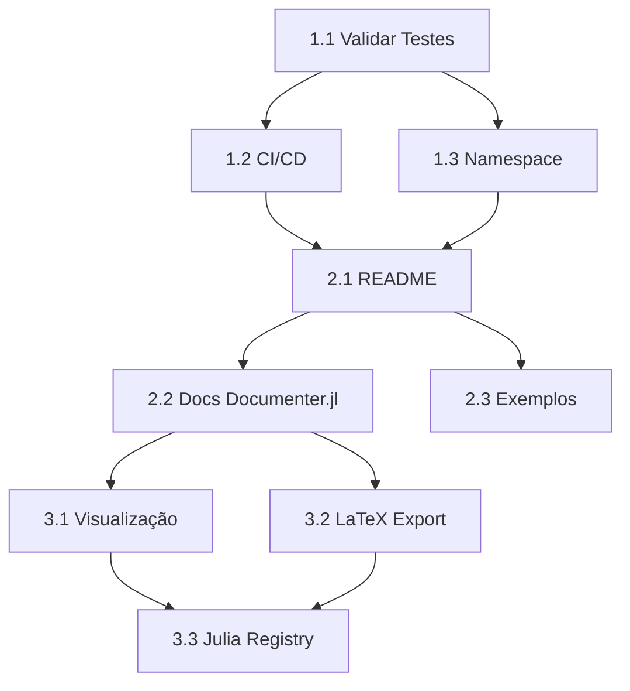

# 📋 Plano de Implementação — ChemicalEquations.jl

**Documento de Roadmap Detalhado**  
**Data**: 2026-08-24  
**Status**: Em Planejamento  

---

## 🎯 Objetivos Estratégicos

| Objetivo | Prioridade | Deadline | Responsável |
|----------|-----------|----------|-------------|
| Validar código existente | 🔴 P0 (imediato) | Esta semana | Dev |
| CI/CD + Testes automatizados | 🔴 P0 | Esta semana | DevOps |
| Documentação inicial | 🟡 P1 | Próxima semana | Dev |
| Evolução (visualização, LaTeX) | 🟢 P2 | Futuro | Research |

---

## 📊 Estrutura de Fases

```
FASE 1 (Esta semana)      FASE 2 (Próxima semana)    FASE 3 (Futuro)
├─ Validação             ├─ Documentação            ├─ Visualização
├─ CI/CD                 ├─ README                  ├─ Export LaTeX
└─ Testes               └─ Exemplos                └─ Julia Registry
```

---

## 🔴 FASE 1 — Estabilização & CI/CD (P0 — CRÍTICA)

### 1.1 Validar Testes Existentes
**Dependência**: Nenhuma  
**Esforço**: 30 min  
**Risco**: 🟡 Médio (valores numéricos podem diferir)

**Tarefas:**
```
□ Executar `julia --project -e 'using Pkg; Pkg.test()'`
□ Verificar se todos os 35+ assertions passam
□ Comparar valores de nullspace (podem normalizar diferentemente)
□ Ajustar tolerâncias se Float64 falhar (~1e-10)
□ Documentar resultado em VALIDATION.log
```

**Checklist de Validação:**
- [ ] `test/compound.jl` — 8 grupos passam
- [ ] `test/chemequation.jl` — 8 grupos passam
- [ ] `test/balance.jl` — 6 grupos + 10 reações complexas passam
- [ ] Sem warnings (deprecation, inference issues)
- [ ] Tempo de teste < 10s

**Saída esperada:**
```
Test Summary:
  compound.jl:     PASS (8/8)
  chemequation.jl: PASS (8/8)
  balance.jl:      PASS (6/6 + 10 reactions)
```

---

### 1.2 Criar GitHub Actions CI/CD
**Dependência**: 1.1 passado  
**Esforço**: 45 min  
**Risco**: 🟢 Baixo (template bem conhecido)

**Arquivo**: `.github/workflows/ci.yml`

**Configuração desejada:**
```yaml
name: CI

on: [push, pull_request]

jobs:
  test:
    runs-on: ubuntu-latest
    strategy:
      matrix:
        julia-version: ['1.8', '1.9', '1.10']  # LTS + latest
    steps:
      - uses: actions/checkout@v3
      - uses: julia-actions/setup-julia@v1
        with:
          version: ${{ matrix.julia-version }}
      - uses: julia-actions/cache@v1
      - run: julia --project -e 'using Pkg; Pkg.instantiate()'
      - run: julia --project -e 'using Pkg; Pkg.test()'
      - uses: julia-actions/julia-covreport@v1
  
  lint:
    runs-on: ubuntu-latest
    steps:
      - uses: actions/checkout@v3
      - uses: julia-actions/setup-julia@v1
      - run: |
          julia --project -e 'using Pkg; Pkg.add("JuliaFormatter")'
          julia --project -e 'using JuliaFormatter; format("src")'
          julia --project -e 'using JuliaFormatter; format("test")'
```

**Tarefas:**
```
□ Criar diretório `.github/workflows/`
□ Implementar `ci.yml` (teste em 3 versões de Julia)
□ Ativar Coverage Report (opcional: CodeCov)
□ Adicionar badge ao README: 
□ Testar em branch feature antes de merge
```

**Resultado esperado:**
- ✅ Cada push roda testes automaticamente
- ✅ Badge verde no README
- ✅ Histórico de builds visível

---

### 1.3 Corrigir Namespace e Imports
**Dependência**: Nenhuma (independente)  
**Esforço**: 15 min  
**Risco**: 🟢 Muito baixo

**Tarefas:**
```
□ Verificar que src/ChemEquations.jl tem `module ChemEquations`
□ Verificar que test/runtests.jl usa `using ChemEquations`
□ Verificar que Project.toml tem name = "ChemicalEquations"
□ Se houver inconsistência, corrigir para ChemicalEquations
□ Rodar testes novamente após fix
```

**Status Esperado:**
- Namespace unificado: `ChemicalEquations` em todo lugar

---

## 🟡 FASE 2 — Documentação & Comunicação (P1 — UMA SEMANA)

### 2.1 Expandir README.md
**Dependência**: 1.1 + 1.2  
**Esforço**: 1.5h  
**Risco**: 🟢 Baixo

**Estrutura proposta:**
```markdown
# ChemicalEquations.jl

[](...)
[](...)
[](LICENSE.md)

## Visão Geral
Escreva e balanceie equações químicas com elegância.

## Instalação
```julia
using Pkg
Pkg.add("ChemicalEquations")
```

## Quickstart
```julia
using ChemicalEquations

# Criar compostos
water = cc"H2O"
chlorine = cc"Cl2"

# Criar equação desbalanceada
eq = ce"H2 + Cl2 → HCl"

# Balancear
balanced = balance(eq)  # H2 + Cl2 = 2 HCl
```

## Exemplos Avançados
### 1. Reação Redox
```julia
eq = ce"Cr2O7{-2} + H{+} + e = Cr{+3} + H2O"
balance(eq)
# → Cr2O7{-2} + 14 H{+} + 6 e = 2 Cr{+3} + 7 H2O
```

### 2. Combustão de Hidrocarboneto
```julia
eq = ce"C2H4 + O2 = CO2 + H2O"
balance(eq)
# → C2H4 + 3 O2 = 2 CO2 + 2 H2O
```

### 3. Hidratos
```julia
eq = ce"CuSO4*5H2O = CuSO4 + H2O"
balance(eq)
# → CuSO4*5H2O = CuSO4 + 5 H2O
```

## API Reference
### Compound
- `cc"string"` — criar composto
- `.tuples` — elementos
- `.charge` — carga líquida

### ChemEquation
- `ce"string"` — criar equação
- `balance(eq)` — balancear
- `balance(eq, fractions=true)` — coeficientes racionais

## Características
✅ Suporta Unicode (símbolos gregos)  
✅ Balanceamento por nullspace  
✅ Reações redox  
✅ Tipos numéricos flexíveis  
✅ Testes abrangentes  

## Roadmap
- [ ] Visualização com Plots.jl
- [ ] Export LaTeX (mhchem)
- [ ] Integração com Catalyst.jl

## Licença
MIT
```

**Tarefas:**
```
□ Escrever estrutura acima
□ Adicionar 3 exemplos práticos (redox, combustão, hidrato)
□ Badges: CI, Docs, License, Version
□ Seção "Características" e "Roadmap"
□ Revisar ortografia/clareza
```

---

### 2.2 Criar Documentação com Documenter.jl
**Dependência**: 2.1  
**Esforço**: 2h  
**Risco**: 🟢 Baixo (tooling Julia nativo)

**Estrutura:**
```
docs/
├── make.jl              (já existe)
├── Project.toml         (já existe)
└── src/
    ├── index.md         (homepage)
    ├── guide.md         (tutorial - novo)
    ├── examples.md      (exemplos práticos - novo)
    └── api.md           (referência API - novo)
```

**Tarefas:**
```
□ Adicionar Documenter.jl em docs/Project.toml
□ Criar docs/src/guide.md (tutorial passo-a-passo)
□ Criar docs/src/examples.md (10+ casos de uso)
□ Criar docs/src/api.md (referência completa com @autodocs)
□ Executar: julia --project=docs docs/make.jl
□ Verificar geração HTML em docs/build/
□ (Opcional) Deploy automático em GitHub Pages via CI
```

---

### 2.3 Criar Exemplos Interativos
**Dependência**: Nenhuma (paralelo)  
**Esforço**: 1h  
**Risco**: 🟢 Baixo

**Arquivo**: `examples/quickstart.jl`

```julia
# examples/quickstart.jl
using ChemicalEquations

# 1. Reação de Combustão
println("=== Combustão de Etileno ===")
eq1 = ce"C2H4 + O2 = CO2 + H2O"
balanced1 = balance(eq1)
println("Desbalanceada: $eq1")
println("Balanceada:    $balanced1\n")

# 2. Reação Redox Complexa
println("=== Redução de Dicromato ===")
eq2 = ce"Cr2O7{-2} + H{+} + e = Cr{+3} + H2O"
balanced2 = balance(eq2)
println("Balanceada: $balanced2\n")

# 3. Hidratos
println("=== Hidrato de Sulfato de Cobre ===")
eq3 = ce"CuSO4*5H2O = CuSO4 + H2O"
balanced3 = balance(eq3)
println("Balanceada: $balanced3\n")

# 4. Coeficientes Racionais
println("=== Com frações racionais ===")
eq4 = ce"H2 + Cl2 = HCl"
balanced4 = balance(eq4, fractions=true)
println("Balanceada (frações): $balanced4")
```

---

## 🟢 FASE 3 — Evolução & Extensão (P2 — FUTURO)

### 3.1 Visualização com Plots.jl
**Dependência**: Código principal estável  
**Esforço**: 3h  
**Risco**: 🟡 Médio (integração com Plots)

**Feature Desejada:**
```julia
using ChemicalEquations, Plots

eq = ce"C2H4 + O2 = CO2 + H2O"
balanced = balance(eq)

plot_stoichiometry(balanced)  # Heatmap da matriz estequiométrica
```

**Implementação:**
```
□ Novo arquivo: src/visualization.jl
□ Função: `plot_stoichiometry(eq::ChemEquation)`
□ Renderizar matriz estequiométrica como heatmap
□ Adicionar labels (compostos, elementos)
□ Exportar função em ChemEquations.jl
□ Exemplos em examples/visualization.jl
```

---

### 3.2 Export LaTeX (mhchem)
**Dependência**: Código principal estável  
**Esforço**: 1.5h  
**Risco**: 🟢 Baixo

**Feature Desejada:**
```julia
eq = ce"H2 + Cl2 = 2 HCl"
latex(eq)  # "\ce{H2 + Cl2 -> 2 HCl}"
```

**Implementação:**
```
□ Novo arquivo: src/latex.jl
□ Funções:
  - `latex(compound::Compound)` → "\ce{H2O}"
  - `latex(equation::ChemEquation)` → "\ce{H2 + Cl2 -> 2 HCl}"
□ Renderizar cargas corretamente: \ce{H{+}} ou H^{+}
□ Testes em test/latex.jl
□ Documentação em docs/src/latex.md
```

---

### 3.3 Publicar no Julia Registry
**Dependência**: Tudo de P0+P1 completo  
**Esforço**: 30 min  
**Risco**: 🟢 Muito baixo (processo automático)

**Passos:**
```
□ Tag versão: git tag v0.1.0
□ Push: git push --tags
□ Abrir PR em github.com/JuliaRegistries/General
□ Aguardar review (~24h)
□ Publicado! Usuários podem fazer Pkg.add("ChemicalEquations")
```

---

## 📈 Matriz de Dependências



---

## ⏱️ Cronograma Proposto

| Fase | Atividade | Estimativa | Data Alvo |
|------|-----------|-----------|----------|
| **1** | Validação | 2.5h | Hoje/Amanhã |
| **1** | CI/CD | 1h | Esta semana |
| **1** | Namespace | 15 min | Esta semana |
| **2** | README | 1.5h | Próxima semana |
| **2** | Docs Documenter.jl | 2h | Próxima semana |
| **2** | Exemplos | 1h | Próxima semana |
| **3** | Visualização | 3h | Após estabilizar |
| **3** | LaTeX | 1.5h | Após estabilizar |
| **3** | Registry | 30 min | Quando pronto |
| | **TOTAL** | **~13.5h** | 2 semanas |

---

## 🎯 Métricas de Sucesso (Definition of Done)

### Fase 1 — Estabilização (CRÍTICA)
- [ ] 100% testes passando
- [ ] CI/CD verde em todas as versões de Julia
- [ ] Namespace unificado
- [ ] 0 warnings/errors

### Fase 2 — Documentação
- [ ] README com 5+ exemplos
- [ ] Documentação HTML gerada (Documenter.jl) sem erros
- [ ] 10+ exemplos de código funcionando
- [ ] API documentada com autodocs (70+ docstrings)

### Fase 3 — Evolução
- [ ] Visualização renderizando sem erros
- [ ] LaTeX export para 15+ equações
- [ ] Publicado no Julia Registry
- [ ] 100+ downloads/mês

---

## 🚨 Riscos Potenciais & Mitigações

| Risco | Probabilidade | Impacto | Mitigação |
|-------|--------------|--------|-----------|
| Nullspace normaliza diferente | 🟡 Média | 🟡 Médio | Ajustar tolerâncias em testes |
| CI falha em Julia 1.8 | 🟢 Baixa | 🟡 Médio | Testar localmente antes |
| Documenter.jl não gera | 🟢 Muito baixa | 🟡 Médio | Usar template de exemplo (JuliaDoc) |
| Plots.jl não instala | 🟡 Média | 🟢 Baixo | Deixar como dependência opcional |
| Registry rejeita PR | 🟢 Muito baixa | 🟢 Baixo | Seguir guidelines de Package Guidelines |

---

## 📝 Próximos Passos Imediatos (HOJE)

1. **Rodar testes**: `julia --project -e 'using Pkg; Pkg.test()'`
2. **Documentar resultado**: Criar arquivo `VALIDATION.log`
3. **Se passar**: Proceder com CI/CD
4. **Se falhar**: Ajustar valores esperados nos testes
5. **Reportar status** ao time

---

## 📞 Contato & Responsabilidades

| Papel | Responsável | Email |
|------|-------------|-------|
| Implementação | Dev | prof.reginaldo.leao@gmail.com |
| Revisão Técnica | Code Review | (pendente) |
| Publicação | DevOps | (pendente) |

---

**Documento Versão**: 1.0  
**Último Update**: 2026-08-24  
**Status**: 🟡 Em Planejamento  
**Próxima Revisão**: Após Fase 1
